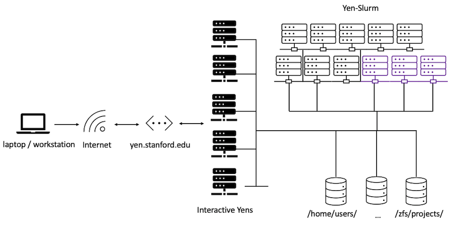

# {{ page.title }}

## Overview

This first session introduces you to Stanford GSB’s research computing cluster — the Yens. You’ll learn how to log in, navigate the file system, set up reproducible Python environments, and run code interactively on the cluster or through JupyterHub. We’ll also take our first step into Slurm by submitting a simple batch job.

> 🔗 **Need help?** Visit [rcpedia.stanford.edu](https://rcpedia.stanford.edu/) or reach out via the [GSB DARC Slack](https://app.slack.com/client/E7SAV7LAD/C01JXJ6U4E5).

---

## Learning goals

By the end of today you will be able to:

- Connect to the Yens via SSH and JupyterHub.
- Navigate the file system using basic shell commands.
- Copy files and folders between your laptop and the cluster.
- Create and activate Python virtual environments.
- Install and link Jupyter kernels to your custom environment.
- Run code via Python scripts and Jupyter notebooks on the Yens.
- Use environment variables securely (e.g., for API keys).
- Explore paths and reproducibility on shared systems.
- Estimate appropriate resources (CPU, memory, time) of scripts interactively.
- Submit your first simple job with Slurm.

---


## Connecting to the Yens

> If you are a Mac or Linux user, you can use the native terminal for these exercises. 
{: .important }

> If you are a Windows user, you can use Git Bash to run these commands.
{: .important }

To SSH from your terminal (replace `<SUNetID>` with your SUNet ID; don't type the `<`, `>` symbols):

```bash
ssh <SUNetID>@yen.stanford.edu
```
You’ll be prompted for Duo authentication.

🟩 / 🟥

### 💻 Command line basics

When you `ssh` to the Yens, you are in your "home" directory. 

Let's explore your environment:

```
pwd                   # Show your current directory
ls -lah               # List files, including hidden ones
cd /scratch/shared    # Change directories
cd                    # Go back to your home directory
mkdir new_dir         # Make a new folder
touch test.py         # Create a blank file
rm test.py            # Be careful! This deletes the file
```


### Copying data to the Yens

Open a new terminal on your local machine (not connected to the Yens).

Make a new file in the text editor of your choice and save it where you can find it  (e.g., your Desktop). For example, name it `hello_yens.txt`. 

Then, we will upload this file from your laptop to the cluster using `scp` (run from your **local** terminal, not the Yens):

```bash
scp ~/Desktop/hello_yens.txt <SUNetID>@yen.stanford.edu:~
```
You’ll be prompted for Duo authentication. After logging in, check that the file was copied correctly by SSHing into the Yens and running `ls` in your home directory.
🟩/🟥

> To copy a folder, use a `-r` (recursive) flag with `scp`.
{: .tip }

Open a new terminal on your local machine (not connected to the Yens).

Make a new **folder** where you can find it  (e.g., your Desktop). For example, name it `test_folder_from_local`. 

Put a file in the folder (text, image, doc, etc). Let's take a screen shot of your screen and move it into this new folder. 

Then, we will upload this folder from your laptop to the cluster using `scp` (run from your **local** terminal, not the Yens):

```bash
scp -r ~/Desktop/test_folder_from_local <SUNetID>@yen.stanford.edu:~
```
You’ll be prompted for Duo authentication. After logging in, check that the folder was copied correctly by SSHing into the Yens and running `ls` in your home directory.
🟩/🟥


## Understanding paths and modules on the Yens

Knowing where things are on your filesystem is very important, and a major 'gotcha' in terms of bugs you'll find in your scripts.

On a filesystem, files have a specific address, which we'll call the "path" to that file. Take a look in your home directory on the Yens where you now have a directory called `test_folder_from_local`. Go ahead and list the contents of this directory from the terminal.

You have to type something like `ls [insert path here]`
🟩/🟥

Here are things you could have typed:

```
ls test_folder_from_local
ls ~/test_folder_from_local
ls /home/users/$USER/test_folder_from_local
cd test_folder_from_local && ls
ls $PWD/test_folder_from_local
```

These use one (or more) of the following approaches:

* Providing an **absolute path**, which starts with `/`
* Providing a **relative path**, which depends on your working directory
* Using a shortcut (`~`) or an **environment variable** (`$USER`)

To invoke any software on the Yens, you have to either use its **path** directly, or it has to be in a special list of places. Let's look at this a little more.

1. Call `python3 -c "print(1+1)"` -- this sends a specific command to python3 and executes it.
2. Find the absolute path of the python executable by typing `which python3`. List the contents of the directory that `python3` is in.
3. The special list of places I referred to is an environment variable called `$PATH`. Type `echo $PATH` to print out the contents.

🟩/🟥

Managing different *versions* of software that can be installed in different locations but might be called the same thing can be very confusing! One way of managing this is to use the `module` system, which manages your environment to make software easily accessible with the right paths and libraries.

Let's use it and explore.

1. Type `module avail` to list all of the available software in the module system.
2. Type `module load R/3.6.3` (Hint: tab autocomplete can save you time!)
3. Type `R` to start R -- look at the welcome message to confirm that it's version 3.6.3.
4. Type `module list` to see your currently loaded modules.
5. Print out, or echo, the contents of your `$PATH` variable. What is different?
6. Type `module unload R/3.6.3`, then try to start `R`. Note the error that you get, and then check your `$PATH` and note what changed.

🟩/🟥

✏️ All this path and version stuff is important for reproducibility. Let’s take a beat to think through what reproducibility means in research.


## 💻 Copy a repo with exercises 

```
cd && git clone https://github.com/gsbdarc/yens-onboarding-2025.git 
```

Navigate to the `exercises` directory:

```
cd yens-onboarding-2025/exercises
```
🟩/🟥


## Access the Yens on the web 
To access JupyterHub, choose any of the following:

- <a href="https://yen1.stanford.edu" target="_blank">`yen1` https://yen1.stanford.edu</a>
- <a href="https://yen2.stanford.edu" target="_blank">`yen2` https://yen2.stanford.edu</a>
- <a href="https://yen3.stanford.edu" target="_blank">`yen3` https://yen3.stanford.edu</a>
- <a href="https://yen4.stanford.edu" target="_blank">`yen4` https://yen4.stanford.edu</a>
- <a href="https://yen5.stanford.edu" target="_blank">`yen5` https://yen5.stanford.edu</a>

Let's navigate by double-clicking on folders to find an image we copied from our local machine. 

> You can double-click on it to view it natively in JupyterHub.
{: .tip }


#### Default Workflow on the Yens Cluster?
   1.	Develop and test code in JupyterHub notebooks.
   2.	Convert the notebook to a script.
   3.	Run the script from the terminal (interactive yen or batch job).


> **You can always type Shift+Enter to run a cell in Jupyter Notebook.**
{: .tip }

#### Quick Jupyter Notebook Demo

1. In your home directory, create a new notebook named Test.ipynb.
2. Add a code cell: import math. (❓Check your kernel.)
3. Add a markdown cell: # Variable declaration.
4. Add a code cell: x = 16.
5. Add another code cell: math.sqrt(x).
6. Run the cells. Try restarting the kernel and running them in a different order.

🟩/🟥


## Run scripts from the terminal

💻 Create a Python script:

```
touch test_script.py
```

Edit this file in Jupyter Text File Editor.

The content for `test_script.py`:

```python
print("Hello from the Yens!")
```

Save this 🐍 file. 

💻 Run the script:

```
python3 test_script.py
```

🟩/🟥


## How to run python scripts that import libraries
Let’s look at the script called `extract_form_3_one_file.py` inside the `scripts` directory.

```bash
cat scripts/extract_form_3_one_file.py
```

❓: What is the script doing? (Let's look at a high level)

### Purpose 

- Import libraries
- Load secrets
- Define schema for LLM model output
- Define LLM parameters
- Call API
- Handle API return


#### Understanding the imported libraries
Before we can run this script, every user needs to have packages that the script imports installed. This is true for other languages like R and Julia as well.

  1. You should have a terminal connected to the Yens open or terminal in JupyterHub.

  2. You should be in the `~/yens-onboarding-2025/exercises` directory

  3. Now that we looked at the python script, let's look at the `requirements.txt` file:

```
cat requirements.txt
```

❓ What is `requirements.txt` file?

❓ Why is it useful?

#### Securely using environment variables
Let’s load your OpenAI API key (or any secret) using `dotenv`.

1. 💻 We created a hidden file to store secrets. Let's look at it:

   ```
   cat /scratch/shared/yens-onboarding-2025/.env
   ```

2. 🐍 Load the variable in Python:

   ```python
   import os
   from dotenv import load_dotenv
   load_dotenv('/scratch/shared/yens-onboarding-2025/.env')
   api_key = os.getenv("OPENAI_API_KEY")
   ```

This allows you to use secrets without hardcoding them into scripts. 


## 💻 Create a python virtual environment

A virtual environment lets you manage project dependencies in isolation. This is useful because different projects often require different versions of libraries, and keeping them separate prevents conflicts.

#### Why Virtual Environments Matter

Try this quick demo:
1. Open a terminal and SSH into the Yens.
2. Open a terminal from JupyterHub.
3. Run `which python3` in both terminals.

Compare the outputs, notice how the paths differ? That’s why virtual environments are important: they give you control over which Python installation and dependencies your project uses.


🟩/🟥

Let’s make a virtual environment from the `requirements.txt` file:

Run the following commands in the `~/yens-onboarding-2025/exercises` directory:

```
/usr/bin/python3 -m venv venv
source venv/bin/activate
```
This runs a script that’s located in the `./venv/bin` directory called `activate`. The `bin` directory doesn’t mean like, a literal bin. It’s short for `bin`ary, things that can be executed as programs, as opposed to data or configuration files.

> You will know the activation was successful when you see `(venv)` at the beginning of your terminal prompt. This indicates that the virtual environment is active.
{: .tip}

Your environment is activated, so now you can install packages using `pip`. Let’s try it.
```
pip install -r requirements.txt
```

These libraries are now installed in *this* environment. You can load the packages while the environment is activated, but it’s not installed for anyone else. Test it out! Try importing `numpy` and `dotenv` in the Jupyter terminal with your virtual environment activated and deactivated. 

> 🐍 For new python users, type `python3` to start a python console then in the console type `import numpy`. What happens when you try to import a package with the virtual environment activated and deactivated?
{: .tip }

🟩/🟥

## 💻 Run python script using virtual environment

Run the `scripts/extract_form_3_one_file.py` script using the virtual env you just made:

```
python scripts/extract_form_3_one_file.py
``` 

❓: What do you see?

🟩/🟥


## 💻 Use your python environment in Jupyter

One of the packages we installed, the `ipykernel` package, provides the tools to connect your environment to Jupyter. We can create a new Jupyter kernel linked to your virtual environment. Replace `<kernel_name>` with a description name for your environment (e.g. `yens-onboarding-env`). Make sure you’re in your active venv when you run this command!

```
python -m ipykernel install --user --name=<kernel_name>
```

In the Jupyter interface, go to your `yens-onboarding-2025/exercises` folder, and start a new notebook. Name it `Test.ipynb`. Change the kernel to `yens-onboarding-env` or whatever your kernel is named.

You should be able to run:

```
import dotenv
```
You can now run code that uses packages from your environment. If you can’t, let’s get help!

🟩/🟥


## Cluster Resources



✏️ Let's pretend you are a cook.


# ✏️ Interactive Yens


Lets take a look at one of the interactive nodes. There are 5 interactive nodes (yen1-yen5), each with a large number of cores and RAM.

- **Shared** storage across nodes: <br>
All interactive Yen nodes (yen1–yen5) mount the same central storage system (ZFS-backed). Anything saved in your home directory on one node is immediately available on the others. Project directories are also mounted across all nodes

- Per-node CPU and RAM:  
Each **interactive** Yen node has its own [CPU cores and memory](https://rcpedia.stanford.edu/_getting_started/yen-servers/#overview-of-the-yen-computing-infrastructure). These resources are **shared** among all users logged into that node. If someone runs a resource-intensive job, it can affect the responsiveness for others
- Limitations: <br>
There are limits on how many [CPU cores and how much RAM](https://rcpedia.stanford.edu/_policies/user_limits/#interactive-compute-limits) you can use at once on an interactive Yen node. This is to ensure fair access for all users.

# ✏️ Yen-Slurm Cluster

The Yen-Slurm cluster has its own pool of compute nodes, separate from the interactive Yens. These nodes are dedicated to running batch jobs that you submit through the Slurm workload manager.

Slurm is the scheduler that handles resource management and job execution on the cluster. It allows you to:

- Submit jobs that run in the background.
- Request specific resources (CPU cores, memory, time).
- Queue, monitor, and manage many jobs efficiently.

While all users share access to the Yen-Slurm cluster, Slurm allocates dedicated resources for each job. This ensures that your job runs with the CPUs, memory, and time you requested, independent of other users’ workloads.


- If you ask Slurm for 50 CPUs and 200 GB of RAM for 24 hours, those resources are reserved for your job.
- If you ask for 512 CPUs and 2 TB of RAM for 24 hours, those resources are also reserved for your job.

❓ What’s the catch? <br>
Slurm can only schedule your job if those resources are actually available. If you request more than the cluster can provide, or more than is free at the moment, your job will sit in the queue until the resources free up. Large jobs may wait a long time (or never run at all) if they [exceed policy limits or capacity](https://rcpedia.stanford.edu/_policies/user_limits/#interactive-compute-limits).


In order to help you get the jobs you need done we offer a variety of slurm `partitions` (queues) that have different [limits on resources and time](https://rcpedia.stanford.edu/_policies/user_limits/#slurm-resource-limits).


# ✏️ Kitchen demo!

I need some volunteers to help me cook a meal.


## 💻 Run a mystery python script

Login to the Yens.

Take a note of which interactive yen (yen[1-5]) you are on. Then, open a new terminal (or second tab if using Jupyter), and connect to the **same** yen.

Now you should have two terminals, both connected to the same interactive yen.

In one of the terminals, run a mystery script four times:

```
cd yens-onboarding-2025/exercises/scripts
python3 mystery_script.py
```

1. While the script is running, in a second terminal connected to the same yen, watch the script run while running `htop`.

2. While the script is running, in a second terminal connected to the same yen, watch the script run while running `htop -u $USER`.

3. While the script is running, in a second terminal connected to the same yen, watch the script run while running `watch userload`.

4. To time the script, run in one of the terminals:

```
time python3 mystery_script.py
```
Key things to watch:

- Peak RAM usage
- Number of cores used
- Runtime


Compare with your neighbor the time, cores and RAM usage for this script.

❓ What do you see?

🟩/🟥

Now we know how many resources the script needs, we can submit it as a batch job to the scheduler requesting the resources from it.

## Submitting your first Yen-Slurm job

Navigate to `~/yens-onboarding-2025/exercises/slurm` directory:

```
cd ~/yens-onboarding-2025/exercises/slurm
```

Let’s make your first slurm job script. You can do this in JupyterHub using Text Editor.

1. Make a new file in the `slurm` directory called `my_first_job.slurm`.

2. Start the file with the bash shebang line:

   ```
   #!/bin/bash
   ```

   This line is called a "shebang." It tells the system to run the script using the Bash shell interpreter (`/bin/bash`). This ensures consistent behavior for shell commands like `cd`, `source`, and environment variables — regardless of the user's default shell.

3. Add Slurm job configuration flags that request appropriate resources (replace `your_email` with your Stanford email):

   ```
   #SBATCH --job-name=my-first-job
   #SBATCH --output=my-first-job.out
   #SBATCH --time=10:00
   #SBATCH --mem=4G
   #SBATCH --cpus-per-task=1
   #SBATCH --mail-type=ALL
   #SBATCH --mail-user=your_email@stanford.edu
   ```

   The `--output=my-first-job.out` flag tells Slurm to save all job outputs (printed to screen) in a text file named `my-first-job.out` in the same directory (`~/yens-onboarding-2025/exercises/slurm`).

4. Finally, add a line to print a message:

   ```
   echo "Hello there!"
   ```

Save this file.

🟩/🟥

### 💻 Let’s submit it:

Run:
```
sbatch my_first_job.slurm
```
You’ll see output like:

```
Submitted batch job 123456
```

The `123456` is a job ID which is unique for every job on the cluster.


## Monitoring slurm jobs

View the job queue:

```
squeue
```

Or filter to just your jobs:
```
squeue -u $USER
```

Cancel a job if needed:
```
scancel <job-id>
```

## Checking results
After the job completes:

Look at the `.out` file created:
```
cat my-first-job.out
```

You should see:

```
Hello there!
```

If you included your email in `--mail-user`, you’ll also receive an email from Slurm when the job starts and ends.


## Summary
You're now ready to:

- Connect and move around the Yens

- Copy data to/from the cluster

- Create and use virtual environments

- Run code from both notebooks and the terminal

- Manage packages and secrets in a reproducible way

- Measure CPU/RAM needs interactively

- Submit your first Slurm job
